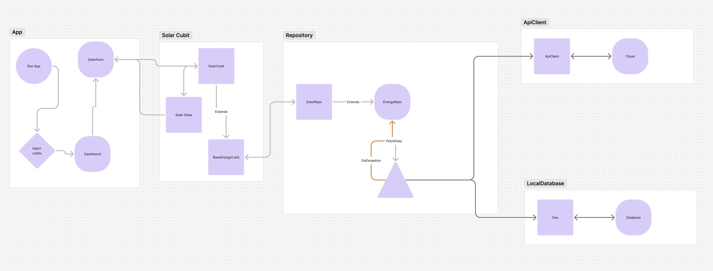

# Energy Monitor App

## Overview

The Energy Monitor App is designed to track and manage energy consumption and generation data.
It uses Flutter for the frontend and Drift for local database management.
The app follows a clean architecture and SOLID principles, separating concerns into different layers
and components.
Key components include the main entry point (main.dart), the main application widget (
energy_monitor_app.dart),
various Cubits for state management, and repositories for handling data operations. The app also
includes utilities
for internet connectivity and data parsing, ensuring efficient and reliable performance.

## Features

- Graph and Data Visualization

  – Solar Generation: Displays a graph of solar generation over time.

  – House Consumption: Displays a graph of household energy consumption.

  – Battery Consumption: Displays a graph of battery energy consumption.
- Implemented as a Line Chart, where the x-axis represents datetime and the y-axis represents values
  in watts.
- Included data preloading for each tab so graphs load instantly when switching tabs.
- Provided date filtering for data
- Supports unit switching between watts and kilowatts.

## Structure



## Getting Started

### Prerequisites

- Flutter SDK: [Install Flutter](https://flutter.dev/docs/get-started/install)
- Dart SDK: Included with Flutter
- Android Studio or Visual Studio Code: Recommended IDEs for Flutter development

### Installation

1. Clone the repository:
   ```sh
   git clone https://github.com/muhammadmateen027/energy_monitor
   cd energy_monitor
   ```
2. Install dependencies:
   ```sh
    flutter pub get
    ```
3. Build runner:
   ```sh
   # run this command inside all the sub packages (repository, client, and databases)
    flutter pub run build_runner build
    ```
4. Run the app:
   ```sh
    flutter run
    ```

5. Run the tests:
   ```sh
   # run this command inside all the sub packages (repository, client, and databases)
    flutter test
    ```
6. Integration tests:
   ```sh
   # run this command inside the test_driver folder
    flutter test integration_test/app_test.dart
    ```

## Architecture

The app follows a layered architecture with the following layers:

### Presentation Layer

- **Cubits**:
    - Manage the state of the application.
    - Contains the UI and state management logic using Cubit.
    - Cubit interacts with the domain layer to fetch and manage data.
    - Cubit also downsample data for performance.
    - Cubits manage the state of the application.

### Domain Layer

- **Repositories**: Define the contract for data operations.
    - Contains the domain models and business logic.
    - Handle data operations using repositories.
    - Repositories interact with the data layer to fetch and store data.
    - Have separate repositories for battery, house consumption, and solar data to keep the code
      clean and modular.
    - `battery_repository.dart`: Manages battery consumption data.
    - `house_consumption_repository.dart`: Manages house consumption data.
    - `solar_repository.dart`: Manages solar generation data.

- **Data Parser**: Converts data between different formats.
    - `data_parser.dart`: Parses data using isolates for performance.
- **Connectivity Checker**: Check internet connectivity.

### Data Layer

- **Database**: Manages local data storage using Drift.
    - `app_database.dart`: Configures the Drift database.
    - `monitoring_data_point_dao.dart`: DAO for monitoring data points.
- **API Client**: Fetches data from external APIs.
    - `energy_client.dart`: Client for fetching energy data.

## Business Logic

### Cubits

- **EnergyBaseCubit**: Abstract class that provides common functionality for energy-related Cubits.
- **BatteryCubit**: Extends `EnergyBaseCubit` to manage battery consumption data.
- **HouseConsumptionCubit**: Extends `EnergyBaseCubit` to manage house consumption data.
- **SolarCubit**: Extends `EnergyBaseCubit` to manage solar generation data.

### Repositories

- **BatteryRepository**: Fetches and clears battery consumption data.
- **HouseConsumptionRepository**: Fetches and clears house consumption data.
- **SolarRepository**: Fetches and clears solar generation data.

### Database

- **AppDatabase**: Configures the Drift database and provides DAOs.
- **MonitoringDataPointDao**: Provides methods to insert, update, delete, and query monitoring data
  points.

### API Client

- **EnergyClient**: Fetches energy data from external APIs.

## Interconnections

1. **Cubits** interact with **Repositories** to fetch and manage data.
2. **Repositories** use the **API Client** to fetch data from external sources and the **Database**
   to store and retrieve data locally.
3. **Data Parser** is used by **Repositories** to convert data between different formats.
4. **Connectivity Checker** ensures that the app can handle offline scenarios gracefully.

## Conclusion

The Energy Monitor App is designed with a clean architecture, separating concerns into different
layers and components. This structure ensures that the app is maintainable, scalable, and testable.